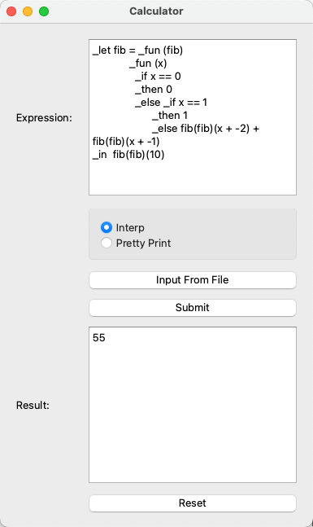
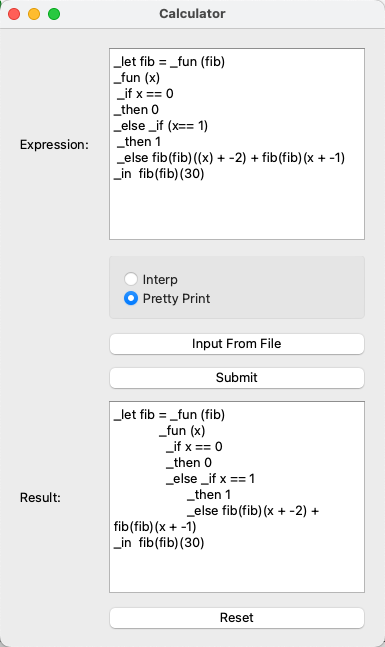

# Expression Calculator

A calculator for expressions with predefined grammar, including basic calcualtions, let statements, if statements, and function calls. The expressions can be typed in or imported from existing files. 

## Grammar

1. Add: `<expression1> + <expression2>`
2. Multiply: `<expression1> * <expression1>`
3. Variable (only accept alphabetic words): , `x`, `var`, ...
4. Let: `_let x = 3 _in x + 1`, ...
5. Bool: `_true` & `_false`, ...
6. Comparison: `<expression1> == <expression2>`
7. If:  `_if _true _then 0 _else 1`, `_if x == 5 _then x + 1 _else x`,
8. Function: `_fun(x) x + 1`, ...
9. Function call: `(_fun(x) x + 1)(1)`, `_let f = _fun(x) x + 1 _in f(1)`, ...

## Run it locally

1. clone the repo: `git clone https://github.com/Sonia-96/Expression_Calculator_in_CPP`
2. open `Calculator/Calculator.pro` file

## Use it

### Interp

Calculate the result of an expression. For example, the result of Fibonacci(10) is 55.

### Pretty Print

Print an expression in a nicer format. In the following example, the statements will be aligned and the redundant brackets will be removed through `Pretty Print` mode.

